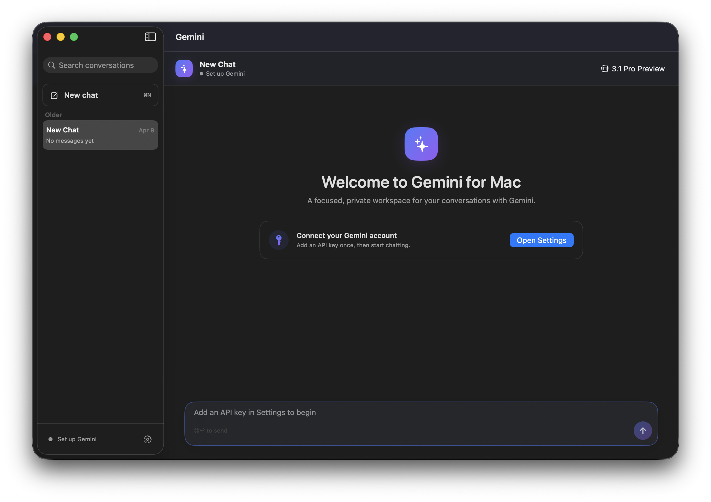

# Gemini desktop for MacOS PoC

macOS chat app on SwiftUI for Xcode with Gemini API key support.

## Screenshot

## Important Notice

- **Gemini is a trademark/product of Google** (Google LLC).
- This repository is an **independent educational project** and is **not affiliated with, endorsed by, or sponsored by Google**.
- The project is intended for learning SwiftUI/macOS development and Gemini API integration examples.

## Current Features

- Grouped multi-chat sidebar with search, quick switch, and chat delete
- Streaming assistant output (SSE) with automatic fallback to non-streaming request
- Model picker with API-based model discovery (`ListModels`)
- Connection status states: not configured / not checked / checking / connected / failed
- Native macOS Settings window for connection, behavior, and safety
- System prompt support with automatic retry for unsupported models
- Safety presets: `default`, `strict`, `balanced`, `relaxed`, `off`
- Stop generation while streaming
- Rich assistant Markdown for headings, lists, quotes, links, and code blocks
- Message copy actions and hover metadata
- Local chat history persistence between app launches

## Data Storage

- API key is stored locally in `UserDefaults`
- Model, system prompt, and selected safety preset are stored in `UserDefaults`
- Chat history is saved to:
  `~/Library/Application Support/GeminiChatMac/chat-history.json`

## Requirements

- Xcode with Swift 5 support
- macOS deployment target in project: `14.6` (`GeminiChatMac` target)
- Valid Gemini API key

## Run in Xcode

1. Open `GeminiChatMac.xcodeproj`.
2. Select scheme `GeminiChatMac`.
3. Build and run.

## Usage

1. Open **Settings** (`Cmd+,`) and paste your Gemini API key.
2. Click **Check Connection** to load available models.
3. Optionally configure **System Prompt** and **Safety level**.
4. Start a new chat or continue from sidebar history.
5. Press `Cmd+Return` to send. `Return` inserts a new line, and `Escape` stops generation.

## Gemini API Endpoints Used

- `GET https://generativelanguage.googleapis.com/v1beta/models?key={API_KEY}&pageSize=1000`
- `POST https://generativelanguage.googleapis.com/v1beta/models/{model}:streamGenerateContent?key={API_KEY}&alt=sse`
- `POST https://generativelanguage.googleapis.com/v1beta/models/{model}:generateContent?key={API_KEY}`
